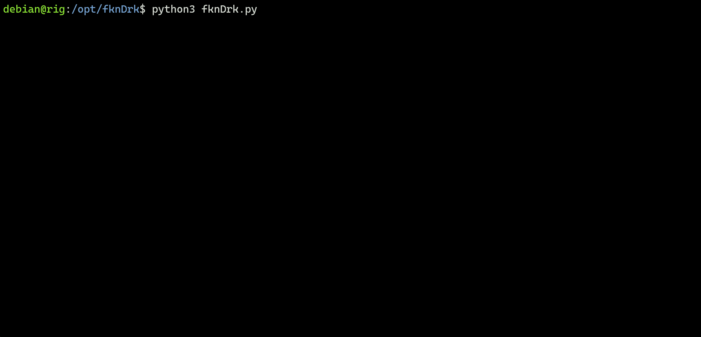

# FKNDRK

FKNDRK is a Python script for automating the Google Dorking process. It streamlines the process of Google Dorking by utilizing public proxies and the ScraperAPI (scraperapi.com) free API key. It searches for specific information on websites indexed by Google, based on a list of dorks provided in a file.

FKNDRK is designed to run concurrently using multiple threads, allowing for efficient and faster searches. Results are saved in a dedicated folder as JSON files, making it easy to analyze and process the data.


## Features

- Concurrent searching using multiple threads
- Utilizes public proxies and ScraperAPI
- Saves search results in JSON format
- Customizable list of dorks and user agents

## Installation

1. Clone the repository:

```bash
git clone https://github.com/your-username/fkndrk.git
cd fkndrk
```

2. Install the required Python packages:

```bash
pip install -r requirements.txt
```

3. (Optional) Obtain a ScraperAPI key for better results and add it to the `.env` file. You can sign up for a free account on the [ScraperAPI website](https://www.scraperapi.com/).

## Usage

1. Provide a list of dorks in the `config/dorks.txt` file.

2. Set up user agents in the `config/user_agents.txt` file.

3. Run the script:

```bash
python3 fknDrk.py
```



4. Use the following command-line options to customize the script's behavior:

```bash
-v, --verbose Display errors with proxies.
-t, --threads Number of threads to use for searching (default: 20).
-n, --numResults Number of results to save per dork (default: 30).
-maxp, --max-paid Maximum number of times to use the paid proxy (default: 0).
-d, --debug Enable debug mode.
```


## Contributing

Contributions are welcome! Please feel free to submit a pull request or open an issue on GitHub.

## Author

  - Dap  
  - Twitter: @Dapunhinged
