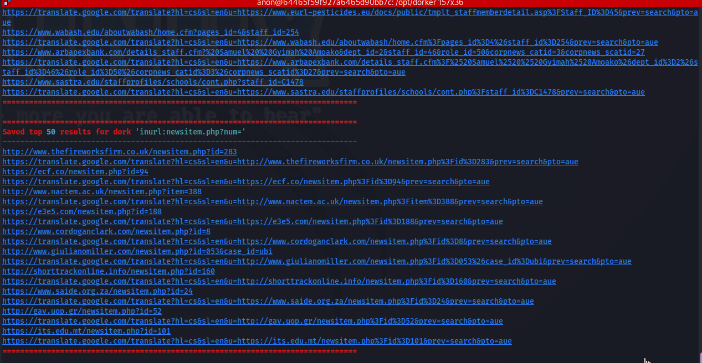

# fknDrk

Automatically google-dork from a large list of dorks and write results to file. Scrapes public proxies, tests each scraped proxy, and rotates through the working proxies.


## Installation

1. Clone the repository: `git clone https://github.com/dap-ware/fknDrk.git`
2. Navigate to the cloned directory: `cd fknDrk`
3. Install the requirements: `pip install -r requirements.txt`
4. Make the script executable: `chmod +x fknDrk.py`

## Usage

Run the script with the following command:
```bash
./fknDrk.py
```



The script will begin running and automatically search for dorks, test proxies, and write results to file. You can configure the number of threads used for searching and the number of results saved per dork with command-line arguments:
```bash
python3 fknDrk.py -t 30 -n 100
```

### Command-Line Arguments

- `-t`, `--threads`: Number of threads to use for searching (default: 20)
- `-n`, `--numResults`: Number of results to save per dork (default: 50)
- `-v`, `--verbose`: Display errors with proxies.
